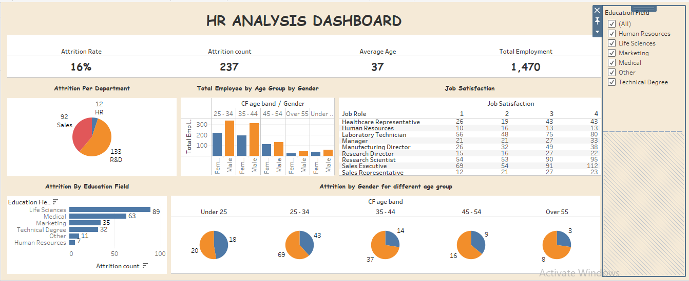
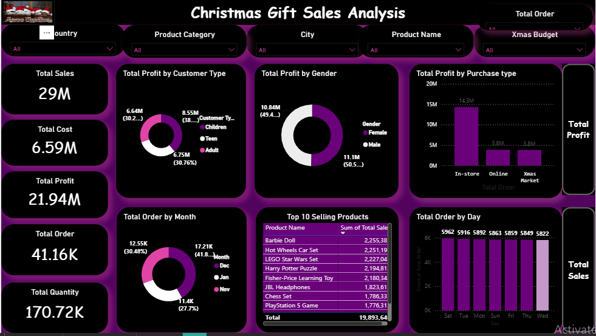
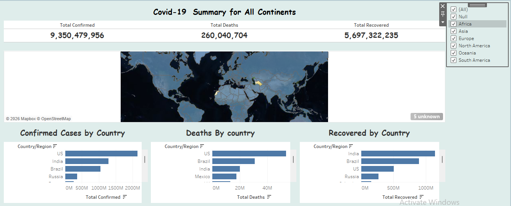

# John Aderibigbe

### Data Analyst | Power BI | Excel | Tableau | SQL

## Professional Summary

I am a Data Analyst with experience in data cleaning, dashboard development, KPI reporting, and business intelligence. I use Power BI, Excel, Tableau, and SQL to transform data into actionable insights.

## Skills:

- Power BI

- Microsoft Excel

- Tableau

- SQL

- Data Cleaning

- Data Visualization

- KPI Reporting

- Dashboard Development

## Data Analytics Projects:

## HR Analytics Dashboard (Tableau)

## Portfolio Description:

Developed an interactive HR Analytics Dashboard in Tableau to analyze employee attrition, workforce demographics, job satisfaction, and departmental trends. The dashboard enables HR teams and business leaders to monitor workforce performance, identify retention challenges, and support data-driven human resource decisions.

## Tools Used:

- Tableau

- Data Cleaning

- Data Visualization

- Interactive Filters

- Dashboard Design

- HR Analytics

## Key Insights:

- The organization recorded a total workforce of 1,470 employees.

- The overall employee attrition rate was 16%, with 237 employees leaving the organization.

- Research & Development experienced the highest attrition count, followed by Sales, while Human Resources recorded the lowest attrition.

- Employees aged 25–34 represented the largest workforce segment across both genders.

- Life Sciences and Medical education backgrounds contributed the highest number of employee attrition cases.

- Job satisfaction levels varied across job roles, highlighting opportunities to improve employee engagement and retention.

## Business Value: 

This dashboard helps HR departments monitor employee turnover, identify high-risk areas of attrition, understand workforce demographics, and support strategic decisions aimed at improving employee retention and organizational performance.

## Christmas Sales Report Analysis (Power BI)

## Portfolio Description:

Developed an interactive Christmas Gift Sales Dashboard in Power BI to analyze sales performance, profitability, customer segments, product performance, and purchasing behavior during the holiday season. The dashboard provides key business insights through KPI tracking, trend analysis, and interactive filtering capabilities.

## Tools Used:

- Power BI

- Power Query

- Data Cleaning

- Data Modeling

- DAX

- Data Visualization

- Dashboard Development

## Key Insights:

- The business generated total sales of 29 million with a total profit of 21.94 million.

- In-store purchases contributed the highest profit compared to online and marketplace channels.

- Adult customers represented the largest customer segment by profit contribution.

- Profit contribution was nearly evenly distributed between male and female customers.

- December recorded the highest order volume, reflecting increased holiday shopping activity.

- Barbie Doll, Hot Wheels Car Set, LEGO Star Wars Set, and Harry Potter Puzzle ranked among the top-selling products.

- Sales activity remained relatively consistent across the days of the week, indicating steady customer demand.

## Business Value:

This dashboard helps businesses monitor sales performance, identify profitable customer segments, evaluate product demand, and optimize marketing and inventory strategies during peak holiday seasons.

## Bike Sales Dashboard (Microsoft Excel)

## Portfolio Description:

Developed an interactive Bike Sales Dashboard in Microsoft Excel to analyze customer purchasing behavior across different demographics, occupations, commuting distances, and education levels. The dashboard enables users to filter and explore key factors influencing bike purchase decisions.

## Tools Used:

- Microsoft Excel

- Pivot Tables

- Pivot Charts

- Slicers

- Data Cleaning

## Key Insights:

- Male customers purchased more bikes than female customers.

- Adults and young adults accounted for the largest share of bike purchases.

- Customers in professional and skilled manual occupations showed higher bike purchase rates.

- Single customers demonstrated a slightly higher bike purchase rate compared to married customers.

- Customers living shorter commuting distances showed stronger bike purchase activity than those traveling longer distances.

- Occupation, age group, and commuting distance appeared to influence bike purchasing decisions significantly.

## Business Value:

The dashboard helps businesses identify target customer segments, understand purchasing patterns, and make data-driven marketing decisions to improve bike sales performance.

## COVID-19 Global Summary Dashboard (Tableau)

## Portfolio Description:

Developed an interactive COVID-19 Summary Dashboard in Tableau to monitor confirmed cases, deaths, and recoveries across countries and continents. The dashboard provides geographic and comparative visualizations that enable users to analyze the global impact of the pandemic and identify regional trends.

## Tools Used: 

- Tableau

- Data Cleaning

- Data Visualization

- Interactive Filters

- Geographic Mapping

- Dashboard Design

## Key Insights:

- Over 9.35 billion confirmed COVID-19 cases were recorded in the dataset.

- Total recoveries exceeded 5.69 billion, indicating significant recovery levels globally.

- The United States recorded the highest number of confirmed cases.

- The United States also reported the highest number of COVID-19 related deaths.

- India recorded the highest number of recoveries among the countries displayed.

- North America, Asia, and South America were among the most impacted regions based on case volumes.

## Business Value:

This dashboard provides stakeholders with a centralized view of global COVID-19 trends, helping users compare the impact of the pandemic across regions and support data-driven public health analysis.

## Professional Experience:

## February 2025-May 2026

## Data Analyst | Mobt6 Global Ltd, Akure. 

-	Collected, cleaned, and validated operational datasets.
  
-	Developed Power BI dashboards and KPI reports.
  
-	Analyzed trends and patterns to identify business opportunities.
  
-	Automated reporting processes using Excel.
  
- Collaborated with stakeholders to deliver actionable insights.
  
-	Supported SQL-based data extraction and validation activities.

## February 2023—July 2024

## Junior Data Analyst | Mebha International Limited, Lagos.

-	Gathered, organized and analyzed operational data.
	
-	Maintained Excel databases and dashboards.
	
-	Produced reports and visualizations for management.
  
-	Performed trend analysis and data validation.
  
-	Supported process improvement through data- driven recommendations.

## Education:

B.Eng. Mechanical Engineering

## Contact:

Email: <aderibigbeoluwatobi22@gmail.com>

LinkedIn: <https://www.linkedin.com/in/john-aderibigbe-195983406>

